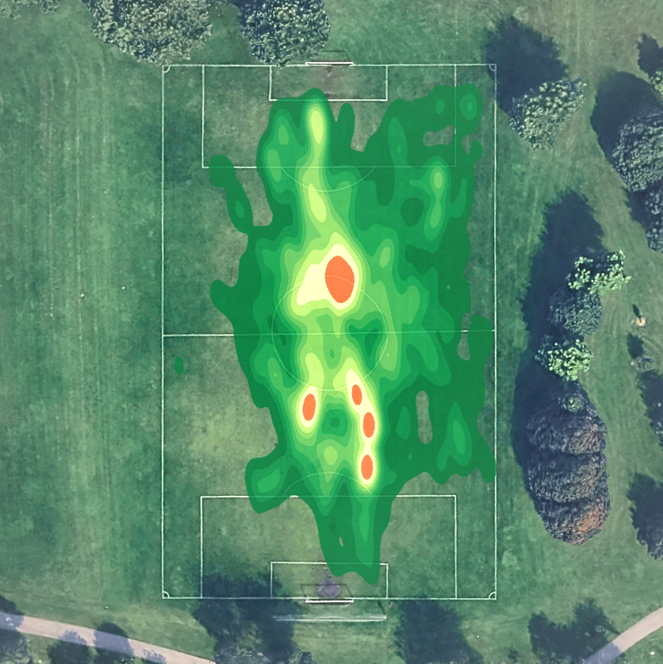
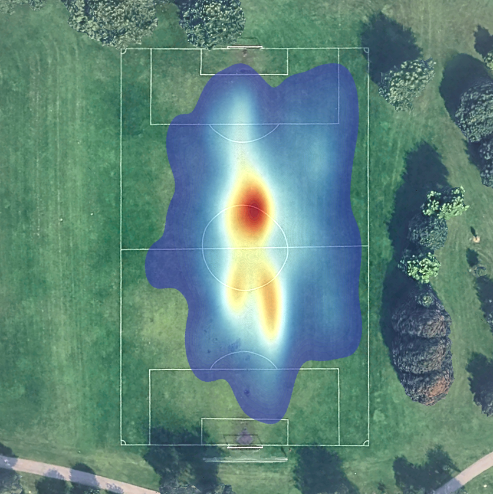

# Soccer GPX Heatmap

Generates positional heatmaps from soccer GPX files and overlays them on satellite imagery. Soccer heatmaps are used to analyze player position and play on the field.

## Usage

1. Place your GPX files in the `data/` directory.
2. (Optional) Adjust the heatmap parameters (threshold, color map, output dir, etc)
3. Run the script `main.py` to generate heatmaps.
4. The generated heatmaps will be saved in the `img/` directory.

### Parameters

- **Input GPX File**: GPX file path in the `data/` directory.
- **Output File**: Output file name and location.
- **Heatmap Style**: Seaborn Colormap style.
- **Heatmap Threhold**: Minimum level of activity to display.
- **Heatmap Alpha**: Transparency level for heatmap atop the pitch image.
- **Heatmap Levels**: Level of detail/smoothing in the heatmap.


## Sample Outputs

### Traditional Heatmap


### Rainbow Heatmap


## Requirements

```sh
pip install matplotlib seaborn numpy gpxpy
